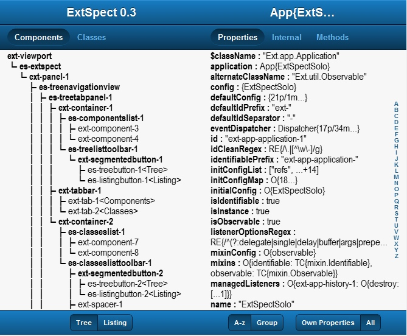

# ReadMe.md for ExtSpect

by Jim.Soper@gmail.com

September, 2014

## INTRODUCTION

Welcome to the ExtSpect, a plugin inspector for Sencha Touch 2 written in Sencha Touch 2. With it you can inspect the component and class hierarchies of the app you plug it into.

## INSTALLATION

For users of the demo app, ux/extspect/Example, the index.html file expects that a touch2 directory will be in a root directory. Please make adjustments in index.html as needed.

For installation of ExtSpect as a plugin, there are several things that you must do, and a couple more optional choices.

* Copy the /ux/extspect folder to be a sibling of your app's main folder.

* In your app.js file, or in the file that first uses Extspect, add the following:

		Ext.Loader.setPath( { uxExtSpect: '../extspect'} )

* This creates a namespace called uxExtSpect. You then require 'uxExtSpect.ExtSpect' to load ExtSpect into your app.

		requires : [ 'uxExtSpect.ExtSpect' ]

* You may, of course, set the path differently. Just make sure that the extspect directory is then where setPath says it is.

* Somewhere inside the views that you build, add ExtSpect as a panel. The ExtSpect class extends Ext.Panel, but it can also be added using the xtype 'extspect'. There are default values for the title and iconCls, so it should fit into a tab panel with no further work.

* There is a config property to the ExtSpect class called app:. This is required. The variable that follows app: is the name of your app (eg. MyApp) plus .app with no quotes. See the ExtSpect/Example.

* Adding ExtSpect to your top level viewport could look like this:

		Ext.Viewport.add( Ext.create( 'uxExtSpect.ExtSpect', { app : MyApp.app } ) )

* As an item in a tab panel, it could look like this:
* 
		{	xtype: 'extspect',
			app: MyApp.app
		}

* Note that we also load in '/ux/extspect/resources/extspect.css'. If you want to set the font or font size, do so here. Extpect uses the default font size.

## USAGE

Using ExtSpect is fairly straightforward. The 'tree panel' on the left lets you look at the component or class hierarchy of the enclosing app. The 'Object panel' on the right shows you the current object and the various properties it contains.

### Tree Panel

* Touching an object on the left displays it in the object panel on the right. 
* Double touching a node in a tree collapses the branch. 
* A node with hidden children is underlined. 
* Double touching that node expands the branch one level down only.
* To expand a closed branch completely, press and hold the node until it exands. 
This takes a long second. Pressing and holding an expanded branch closes it, like double-touching.
* Double touch and holding do not work for the Ext and App panels.

### Object Panel

* On the right, if the property is an 'own' property, the *value* appears in **bold**.
* If you touch a property on the right, and it contains a structured value such
   as an object or array, the object window will show you that object.
* There is no response to atomic values such as numbers or strings, nor to
   empty objects or arrays.
* Touching a property with a collection as a value bypasses the collection object
   and shows you the items in the collection.

Note that the lists do not automatically update for changes in data. They do, however, update on a repaint. To refresh a list, flip to a another tab, and back again.

## CLASS ABBREVIATIONS

Some objects appear wrapped with braces, with letters in front of them. Those letters indicate the name of the class the object instantiates. For example, O{0...} is an instance of Object, and it has no properties. A default config may show {...21p/9m}. This is an object that belongs to no class, and has 21 properties and 9 methods. Some of the abbreviations for classes are:

 	TC : TemplateClass
	App : Ext.app.Application
	MC : Ext.util.MixedCollection
	AMC : Ext.util.AbstractMixedCollection
	IC : Ext.ItemCollection
	E : Ext.dom.Element

	DTL : DOMTokenList
	HC : HTMLCollection
	NL : NodeList
	NNM : NamedNodeMap
	RE : RegularExpression

## util.StringOf

`StringOf` is a package that I developed in 2011. StringOf prints out values in some reasonably concise yet informative way. The primary function is `StringOf.to$()`. ExtSpect uses it heavily.

`util.ExtspectString()` handles most of the class abbreviations mentioned above.

## KNOWN BUGS

* There are problems with the look in Touch 2.2.0. Otherwise it works.

* Sorting by property names may leave some properties out of order. This is especially true in the methods pane, when there are 400+ methods to sort through. It helps to have enough memory.

* With earlier versions of Touch (2.1.1), loading the file sencha-touch.js did not work well.

* Touch 2.3.1 does not work with MS IE 8, 9. 
* It is OK with MS IE 10+.
* It does not work with Opera 9.8 (Presto 2.12). Current versions of Opera (20+) are fine.
* Works OK with Maxthon 3.5.2.1 (earlier version of Webkit)
